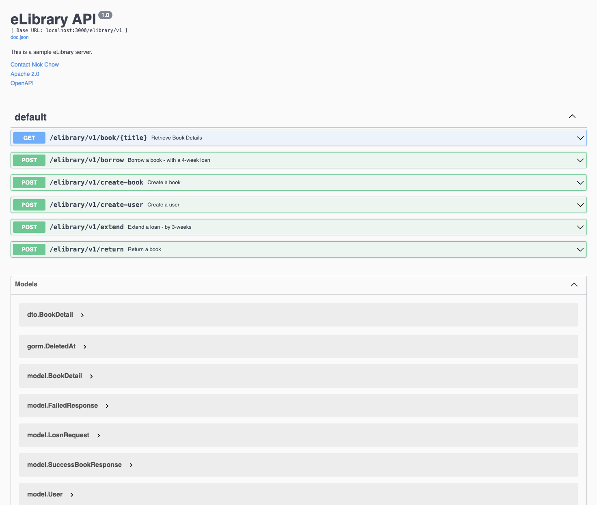

# eLibrary API Microservice

The eLibrary API Microservice is a backend service designed to manage book borrowing, loan extensions, returns, and fetching book details. This service provides a simple and efficient way to interact with an eLibrary system.

## Features

- **Borrow a Book**: Allows users to borrow a book from the library with a fixed duration of 4 weeks.
- **Extend a Book Loan**: Enables users to extend the due date of a borrowed book with a fixed duration of 3 weeks.
- **Return a Book**: Allows users to return a borrowed book.
- **Get Book Details**: Retrieves detailed information about a specific book.

### Admin Functions
- **Create a Book**
- **Create a User**

## Swagger
http://localhost:3000/swagger/index.html#

